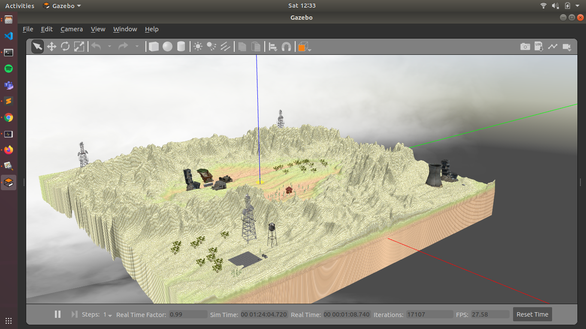
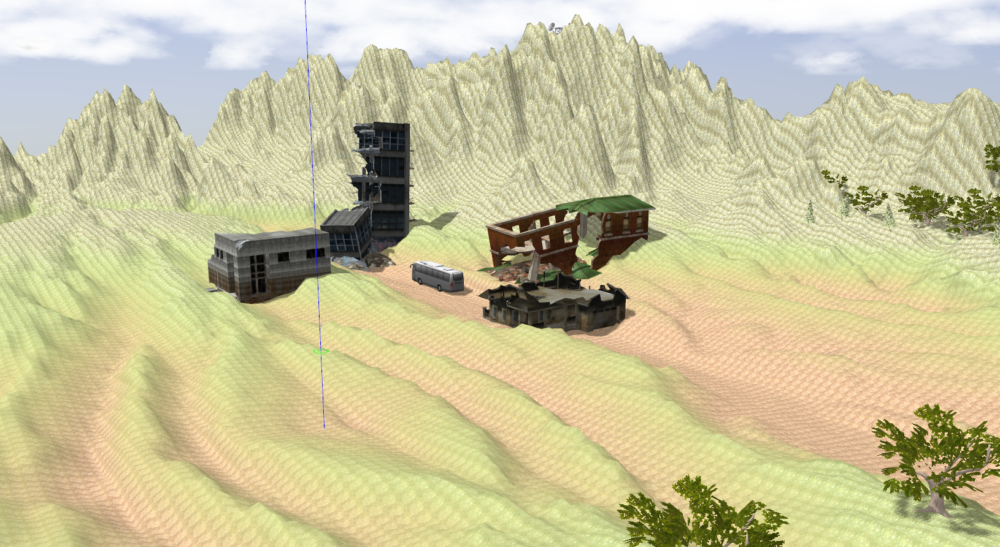
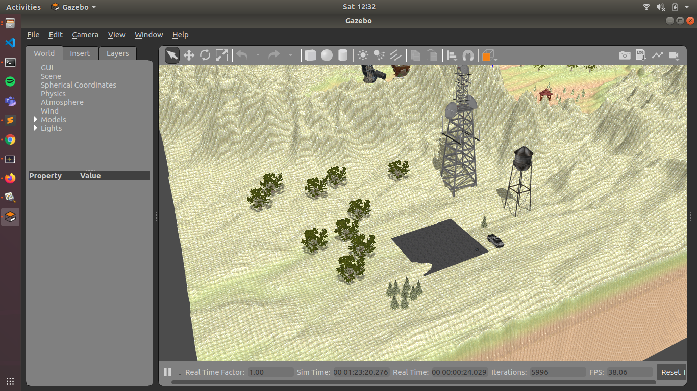
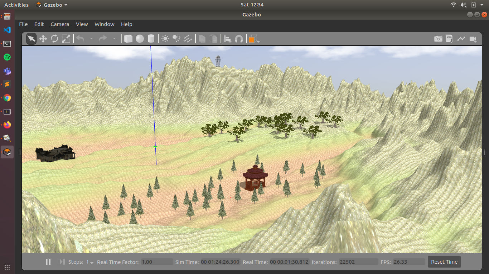
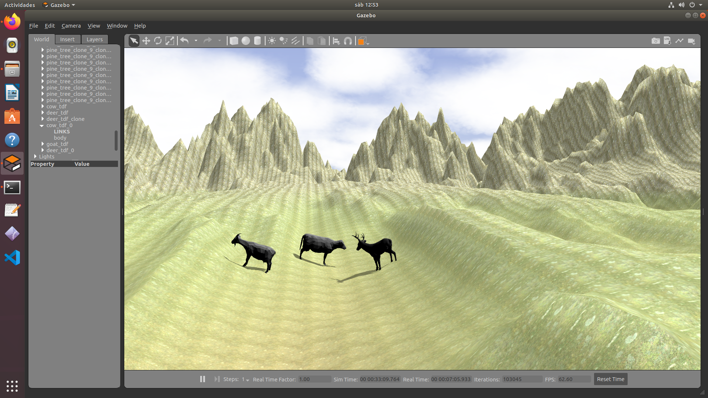

# tdf_gazebo
Gazebo package for simulation of search and rescue robots in tdf mountains based on a heightmap image.



## Clone the repository and import the ROS packages into your catkin workspace
Clone the repository anywhere and do the following to include the packages.
```
git clone https://github.com/Ingenia-SE/TDF-SARUS.git
mv TDF-SARUS/TDF-Sim/* <path_to_your_catkinws>/src/
```

## Build the world in your catkin workspace
Head onto your catkin workspace folder and do the following:
```
source /opt/ros/melodic/setup.bash
catkin_make
```

## Launch the world in your catkin workspace
```
source /opt/ros/melodic/setup.bash
source devel/setup.bash
roslaunch tdf_gazebo start.launch
```

## Description
The world contains multiple environments to design and test search and rescue tasks.

**Collapsed buildings**



**Base to deploy search and rescue robots**



**Forest**



## Models
There are also included animal models to integrate in the world such as cows, goats and wolves. 


